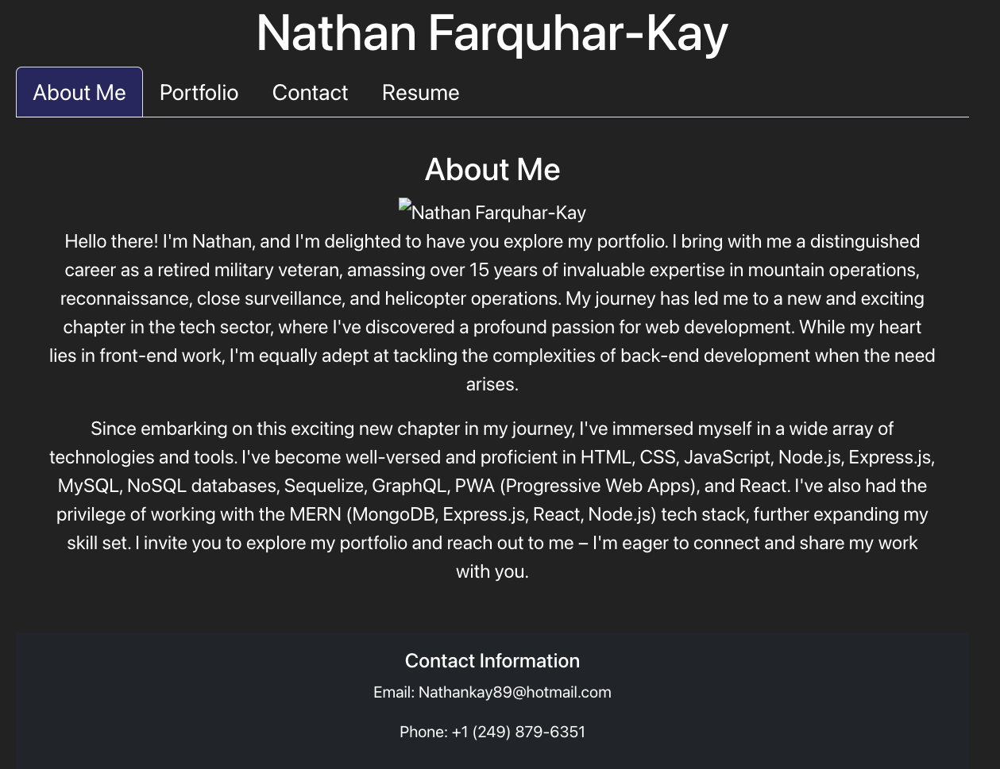

# Portfolio Project

## Description
AS AN employer looking for candidates with experience building single-page applications I WANT to view a potential employee's deployed React portfolio of work samples SO THAT I can assess whether they're a good candidate for an open position I Learned How to utilize React to create a professional looking prtfolio

## Usage
Click on the deployed link below to see the deployed app that should look something like this:

https://main--adorable-stroopwafel-b7510c.netlify.app/›

License
This project is licensed under The MIT License. Here is the link to the license to access more information for your reference: https://opensource.org/licenses/MIT